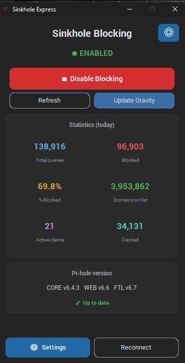
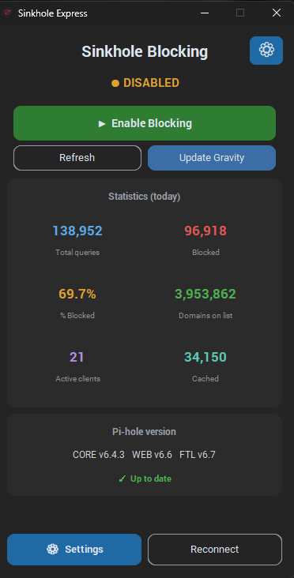

# Sinkhole Express

<p align="center">
  
</p>

<p align="center">
  Lightweight Windows 11 desktop utility to view and toggle
  <a href="https://pi-hole.net/">Pi-hole</a> v6 DNS blocking ON/OFF,
  with live stats and gravity updates — without opening the Pi-hole web admin.
</p>

<p align="center">
  <a href="https://github.com/stavros-it/sinkhole-express/releases"></a>
  <a href="https://www.python.org/downloads/"></a>
  <a href="https://docs.pi-hole.net/main/ftldns/"></a>
  <a href="https://github.com/stavros-it/sinkhole-express/stargazers"></a>
</p>

---

## Features

- **One-click toggle** of Pi-hole v6 DNS blocking (ON / OFF).
- **Live status indicator** — green `● ENABLED` / amber `● DISABLED`, with color-coded toggle button.
- **Statistics panel** — total queries, blocked, % blocked, domains on list, active clients, cached (today's totals).
- **Pi-hole version panel** — shows CORE / WEB / FTL versions and flags when an update is available.
- **Update Gravity** button — re-downloads and rebuilds blocklists (`pihole -g`) via the API.
- **Settings window** — host, port, HTTPS toggle, masked app password (stored in Windows Credential Manager via `keyring`).
- **Windowless launch** — `.pyw` + `pythonw.exe`, no console window.
- **Auto-connect on launch** when credentials are already stored.
- Two editions:
  - **`sinkhole_express_ctk.pyw`** — primary, [CustomTkinter](https://github.com/TomSchimansky/CustomTkinter) UI (modern, dark).
  - **`sinkhole_express.pyw`** — classic Tkinter fallback (fewer dependencies, no stats panel).

## Screenshots

<p align="center">
  <strong>Blocking enabled</strong><br>
  
  &nbsp;&nbsp;
  <strong>Blocking disabled</strong><br>
  
</p>

## Requirements

- **OS:** Windows 11 (primary; code is cross-platform but paths/credential store assume Windows).
- **Python:** 3.12+ from [python.org](https://www.python.org/downloads/). Make sure **"Add python.exe to PATH"** is checked during install.
- **Pi-hole:** v6.x with the REST API enabled (not the legacy v5 `api.php`).
- **App password:** in Pi-hole web admin → *Settings → Web interface / API → App password*.

## Installation

1. Clone the repo:
   ```bash
   git clone https://github.com/stavros-it/sinkhole-express.git
   cd sinkhole-express
   ```
2. Install Python dependencies:
   ```bat
   install_dependencies.bat
   ```
   Installs `keyring` (Credential Manager access) and `customtkinter` (modern UI).
3. *(Optional)* Create desktop shortcuts:
   ```bat
   create_desktop_shortcut.bat
   ```
   Creates **"Sinkhole Express"** (CTk edition) and **"Sinkhole Express (Classic)"** desktop shortcuts that launch via `pythonw.exe` with the bundled `.ico`.

## Usage

1. Launch `sinkhole_express_ctk.pyw` (double-click it, or use the desktop shortcut).
2. On first run it will say *"Open Settings to configure"* — click the **⚙ Settings** button (top-right).
3. Enter:
   - **Pi-hole IP / host** — e.g. `192.168.1.10`
   - **Port** — Pi-hole v6 defaults: `80` for HTTP, `443` for HTTPS (but check `sudo pihole-FTL --config webserver.port` — see *Port gotcha* below).
   - **HTTPS** — tick if your Pi-hole uses TLS.
   - **App password** — from Pi-hole web admin → *Settings → Web interface / API → App password*.
4. Click **Save & Connect**. The app authenticates, fetches status + stats, and the toggle becomes active.

From the main window you can:
- Click the big red/green button to **toggle blocking**.
- Click **Refresh** to re-read status + stats (no re-auth).
- Click **Update Gravity** to rebuild blocklists (takes 20–60 s).
- Click **⚙ Settings** (bottom) to edit connection / change password, or **Clear stored** to wipe the saved password.

## How it works

Sinkhole Express talks to the Pi-hole v6 REST API (`pihole-FTL`) directly:

| Action | HTTP | Endpoint |
|--------|------|----------|
| Authenticate | `POST` | `/api/auth` (returns `session.sid`) |
| Read status | `GET` | `/api/dns/blocking` |
| Toggle blocking | `POST` | `/api/dns/blocking` (`{blocking, timer}`) |
| Stats | `GET` | `/api/stats/summary` |
| Version info | `GET` | `/api/info/version` |
| Update gravity | `POST` | `/api/action/gravity` (streams plain-text progress) |
| Logout | `DELETE` | `/api/auth` |

All network calls run on a background thread (`threading.Thread(daemon=True)`) and results are marshalled back to the UI via `after(0, …)` so the window never freezes.

### Port gotcha (important)

Pi-hole v6 default HTTPS port is **8443**, NOT `443`. But installations vary widely (e.g. `82o,443os` means HTTP on 80/82, HTTPS on 443/8443). To check the real ports on your Pi:

```bash
sudo pihole-FTL --config webserver.port
```

Output suffix flags: `o` = redirect, `s` = TLS. Sinkhole Express auto-suggests 80/443 when you flip the HTTPS switch, but only when the field still holds the other scheme's default — manual overrides are preserved.

## Configuration & security

Two separate stores — **the password is never written to disk in plaintext**.

1. **Connection settings** → JSON file
   - Path: `%APPDATA%\SinkholeExpress\config.json`
   - Keys: `host`, `port`, `https`.
2. **App password** → Windows Credential Manager (via `keyring`)
   - Service name: `SinkholeExpress`, account: `app_password`.
   - ⚠️ Any process running as the same Windows user can read this back. Acceptable for a personal workstation; bear it in mind for shared machines.

## Project structure

| File | Role |
|------|------|
| `sinkhole_express_ctk.pyw` | Main app — CustomTkinter edition (active) |
| `sinkhole_express_ctk1.pyw` | Older CTk snapshot (kept for reference) |
| `sinkhole_express.pyw` | Fallback app — Tkinter edition |
| `sinkhole_express.ico` | Multi-res Windows icon (256→16 px) |
| `sinkhole_express_icon.png` | 512 px PNG preview of the icon |
| `install_dependencies.bat` | Installs `keyring` + `customtkinter` via pip |
| `create_desktop_shortcut.bat` | Creates desktop shortcuts for both editions |
| `PROJECT_CONTEXT.md` | Architecture / endpoints reference for AI coding agents |

## Building an `.exe`

Not bundled yet. Suggested invocation (per the author's usual pattern):

```bat
pyinstaller --onefile --windowed --icon sinkhole_express.ico --name "SinkholeExpress" sinkhole_express_ctk.pyw
```

## Roadmap

- [ ] Timed auto-refresh of stats (e.g. every 10 s).
- [ ] Temporary-disable dropdown (5 / 10 / 30 min) wired to `set_blocking(timer=…)`.
- [ ] Port the stats panel + settings window into the Tkinter edition for parity.
- [ ] PyInstaller build script for a self-contained `.exe`.
- [ ] Greek-language HTML user guide.
- [ ] Multi-Pi-hole support (profiles / dropdown).

## License

Licensed under the **MIT License** — see [LICENSE](LICENSE).

"Pi-hole" is a trademark of Pi-hole, LLC; this project is independent and not affiliated with Pi-hole.

## Acknowledgements

- [Pi-hole](https://pi-hole.net/) — the upstream project whose v6 REST API this app drives.
- [CustomTkinter](https://github.com/TomSchimansky/CustomTkinter) — the modern dark UI framework.
- [keyring](https://github.com/jaraco/keyring) — for secure credential storage in Windows Credential Manager.
